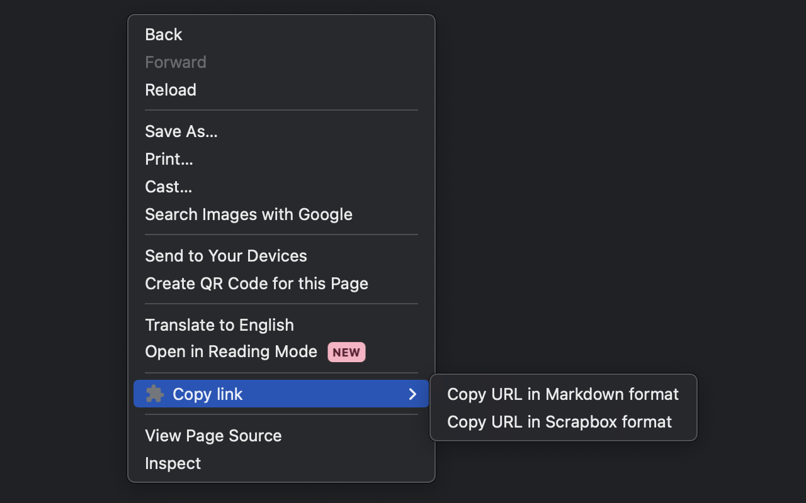

# caat (Copy as Anchor Text)

Add context menu to copy URL as anchor text.

## Available formats

- Markdown
- Scrapbox

## Installation

- [Chrome Web Store](https://chromewebstore.google.com/detail/copy-as-anchor-text/idokhhjbgannibedhipkkahhecpnodkh)
- [🚧 WIP] Firefox Add-ons

## Screenshot

## Development

Edit `background.js` and run build command to update the extension (`build:chromium` for chrome extension, `build:firefox` for firefox add-on).
